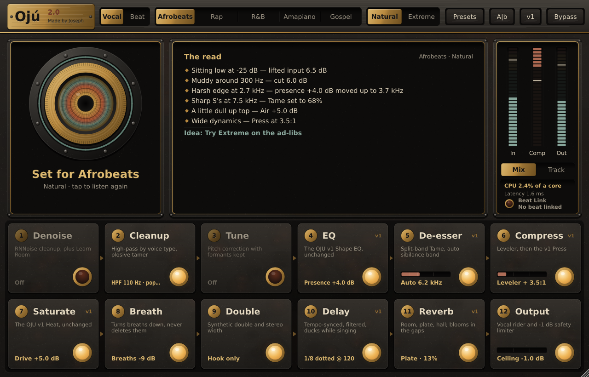
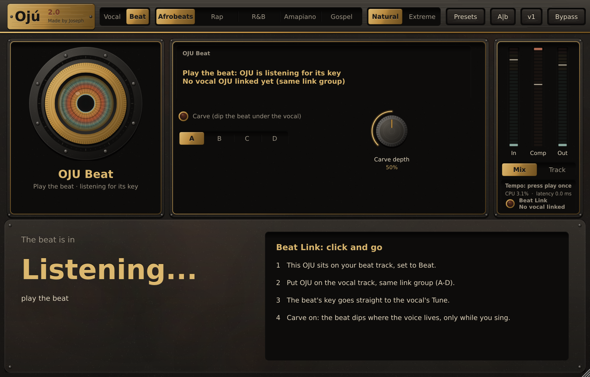

# OJU 2.0 — the vocal chain that listens

**Ojú** is Yoruba for *eye*. Press the brass eye (**Auto**), sing for 10 seconds, and OJU sets up all 12 modules of its vocal chain for you. Then it explains in plain English what it heard and what it changed. OJU 2.0 can also **hear the beat**: put a second copy on the beat track, and the vocal knows the key and gets room in the mix.

Made by Joseph · [madebyjoseph.com](https://madebyjoseph.com) · Bundle ID `com.madebyjoseph.oju`



| Platform | Formats |
|---|---|
| Windows 10/11 (x64) | VST3, Standalone |
| macOS 10.13+ (universal: Apple Silicon + Intel) | VST3, AU, Standalone |

Built with C++17, JUCE 8.0.15 (pinned through CMake FetchContent) and CMake. All DSP is our own code, except the RNNoise network (BSD-3-Clause), which Denoise uses.

## Install

Download the installer for your computer and double-click it. No files to copy by hand.

- **Windows:** `OJU-2.0.0-Windows-Setup.exe` installs the VST3 (plus the Standalone app, if you want it).
- **Mac:** `OJU-2.0.0-macOS.pkg` installs the AU, the VST3 and the Standalone app, on Apple Silicon or Intel.

Every build on GitHub Actions makes both installers. They're under **Artifacts** on the run's page, as *OJU-Windows-Installer* and *OJU-macOS-Installer*. Pushing a version tag (for example `v2.0.1`) also publishes them on the repo's **Releases** page.

Until OJU is code-signed, Windows and macOS each ask once before opening the installer. **[docs/INSTALL.md](docs/INSTALL.md)** has the step-by-step guide, including that one-time click-through.

---

## The chain (fixed order, every module has a lit on/off switch)

| # | Module | What it does | Built from |
|---|---|---|---|
| 1 | **Denoise** | RNNoise cleanup, plus **Learn Room**: stay quiet for 2 s and OJU fingerprints the room's hum and hiss. Natural is gentle (floor -18 dB) and Extreme is aggressive (-30 dB). Slow per-bin release means sustained notes and ad-lib tails are never chopped. | new (RNNoise v0.1.1) |
| 2 | **Cleanup** | High-pass set by voice type, plus a plosive tamer that turns down only the <150 Hz burst of a P or B | v1 low cut + new |
| 3 | **Tune** | Pitch correction. Key comes from Beat Link, a beat file's key tag, the melody you sang (Auto) or a manual key/scale. **Retune** runs from Natural to Hard (robotic snap), plus **Humanize**. PSOLA keeps formants, so there is no chipmunk sound. | new (own YIN + PSOLA) |
| 4 | **EQ** | The OJU v1 Shape EQ | **v1, unchanged** |
| 5 | **De-esser** | Split-band Tame, plus **auto band** that follows where the S's are (4–10 kHz) | v1 + new |
| 6 | **Compress** | Stage 1 is a gentle **leveler** with an auto threshold that follows your level. Stage 2 is the v1 **Press** character compressor. | new + **v1** |
| 7 | **Saturate** | The OJU v1 Heat | **v1, unchanged** |
| 8 | **Breath** | Detects breaths and turns them down (up to -18 dB; they are never deleted) | new |
| 9 | **Double** | Synthetic double-tracking and stereo width. **Hook only** brings it in on the louder sections. | new |
| 10 | **Delay** | Tempo-synced (1/4, 1/8, 1/8 dotted, plus slap and 1/16), filtered repeats. **Ducks while you sing.** | v1 Space + new |
| 11 | **Reverb** | Classic (v1), room, plate or hall. **Ducks while you sing and blooms in the gaps.** | v1 Space + new |
| 12 | **Output** | Vocal **rider** for consistent level, plus a **safety limiter** with a -1 dB ceiling. The v1 soft ceiling is still there. | new + v1 |

**Protecting what works.** The v1 EQ, saturation, compressor, de-esser, space and Natural/Extreme modes were not rewritten. OJU 2.0 wraps the v1 chain and inserts the new modules around it, each behind its own switch. With every 2.0 module off, **the output is bit-identical to OJU v1**. This is checked after every build phase by the null test below, and v1 presets load with all 2.0 modules off.

## Global controls

- **Auto (the eye):** listens to 10 s of real singing. **It keeps the v1 sound**: the EQ, Press, Heat and Space choices are exactly the ones v1 makes, from the same first 4 s of singing. On top, it adds only gentle cleanup:
  - plosive tamer, the auto de-esser band, gentle breath control, a level-neutral rider and the -1 dB safety limiter
  - Denoise only when the room is noisy
  - **Tune, gentle and natural** (slow retune, high Humanize), only when it clearly hears your melody's key

  Double, the Leveler, the room/plate/hall reverbs and delay/reverb ducking stay off until you turn them on. The Read explains each move.
- **Tempo:** OJU reads the BPM from your DAW (Ableton, Logic, Reaper, FL...) and shows it in the status panel with where it came from. It's saved with your session, so it shows the right tempo on reload, even before you press play. If no tempo has arrived yet, it says "press play once": some DAWs only send it while the track plays or is armed.
- **Genre:** Afrobeats, Rap, R&B, Amapiano or Gospel. The v1 styles Trap, Pop and Soul are still in the Presets menu.
- **Natural / Extreme:** applies across all modules, and every module can still be tweaked.
- **Track / Mix:**
  - **Track** means zero latency for recording. The lookahead modules (Denoise, Tune, limiter lookahead) rest, and Saturate runs at 1×.
  - **Mix** means the highest quality, and **the exact latency is reported to Reaper**:
    - v1 chain: 4 samples
    - Denoise: +21 ms
    - Tune: +64 ms
    - Limiter: +1.5 ms
- **Bypass**, **A/B** (two settings), and **v1** (hear the plain OJU v1 sound, all 2.0 modules off).
- **Presets:** genre presets, and save/load your own. They are stored in `Documents/Made by Joseph/OJU/Presets`.
- **CPU meter** and **Beat Link light** in the right-hand column.

## Beat Link: OJU hears the beat

A plugin on the vocal track can't change the beat's audio, so OJU has a second role:

1. Put OJU on the **beat track** and switch it to **Beat** (top left).
2. Put OJU on the **vocal track** (Vocal) in the **same link group** (A–D, default A).
3. That's it. There's no sidechain routing: the two copies talk to each other inside Reaper. Then:
   - OJU Beat hears the beat's key and sends it to the vocal's **Tune** (with Tune's key source on Auto).
   - With **Carve** on, OJU Beat dips the beat's frequencies that fight the vocal, **only while the vocal is singing**. It's a dynamic EQ driven by the vocal.



Beat Link needs both copies in the same process, which is Reaper's default. If you've set Reaper to run plugins in a separate or dedicated process, set OJU back to *native*. With no beat track loaded, **Tune → Key from beat file** reads the key tag (filename such as `Beat Gmin 102bpm`, WAV/ACID tags or MP3 `TKEY`), or listens to the file.

## Performance

Measured on one core at 48 kHz stereo with 256-sample blocks:

| Configuration | CPU |
|---|---|
| v1 sound (all 2.0 modules off) | about 1.7 % |
| All 12 modules on | about 7 % |

**A module that's off costs nothing.** Nothing in the audio callback allocates memory, takes a lock or touches a file (the tests enforce this). All analysis (Auto, the beat's key, Learn Room) runs off the audio thread.

---

## Building

### Windows

1. Install **Visual Studio 2022 or newer** with the *Desktop development with C++* workload. CMake comes with it.
2. Install **Git** from git-scm.com. CMake uses it to download JUCE.
3. Open the **x64 Native Tools Command Prompt for VS**, `cd` into this folder, and run:

```bat
build-windows.bat
```

The first build downloads JUCE and takes a few minutes. The output is:

```
build-win\OJU_artefacts\Release\VST3\OJU.vst3        ← the plugin (a folder)
build-win\OJU_artefacts\Release\Standalone\OJU.exe   ← the standalone app
```

To install in one step, run `build-windows.bat install` from an **Administrator** prompt. It copies `OJU.vst3` to `C:\Program Files\Common Files\VST3\`.

The plugin links the MSVC runtime statically, so users don't need the VC++ redistributable.

### macOS

1. Install **Xcode** from the App Store and open it once. The Command Line Tools also work.
2. Install **CMake**: `brew install cmake`.
3. In Terminal, from this folder, run:

```bash
./build-mac.sh            # build a universal Release (arm64 + x86_64)
./build-mac.sh install    # build, then copy VST3 + AU into ~/Library/Audio/Plug-Ins
```

The output is:

```
build-mac/OJU_artefacts/Release/VST3/OJU.vst3
build-mac/OJU_artefacts/Release/AU/OJU.component
build-mac/OJU_artefacts/Release/Standalone/OJU.app
```

To check the AU, run `auval -v aufx Ojue Mbyj`.

### Offline or a pinned JUCE checkout

```bash
cmake -S . -B build -DFETCHCONTENT_SOURCE_DIR_JUCE=/path/to/JUCE-8.0.15
```

---

## Installing in your DAW

The installers put OJU in the system plugin folders: `C:\Program Files\Common Files\VST3` on Windows; `/Library/Audio/Plug-Ins/VST3` and `/Library/Audio/Plug-Ins/Components` on Mac. `build-mac.sh install` uses the per-user `~/Library/...` folders instead. DAWs scan both.

| DAW | Where the plugin goes | Then |
|---|---|---|
| **Reaper** (Win) | `C:\Program Files\Common Files\VST3\OJU.vst3` | *Options → Preferences → Plug-ins → VST → Re-scan*. Insert **VST3: OJU (Made by Joseph)** on the vocal track's FX chain. |
| **FL Studio** (Win) | `C:\Program Files\Common Files\VST3\OJU.vst3` | *Options → Manage plugins → Find more plugins* (tick *Verify plugins*). Star **OJU**, then load it in a Mixer insert slot on the vocal. |
| **Ableton Live** | Win: `C:\Program Files\Common Files\VST3\` · Mac: `~/Library/Audio/Plug-Ins/VST3/` | *Settings → Plug-Ins → turn on "Use VST3 Plug-in System Folders" → Rescan*. |
| **Logic Pro** | `~/Library/Audio/Plug-Ins/Components/OJU.component` | Logic scans it on launch. Use *Audio FX → Audio Units → Made by Joseph → OJU*. If it doesn't appear, open *Plug-in Manager* and click *Reset & Rescan Selection*. |
| **Reaper / Ableton** (Mac) | `~/Library/Audio/Plug-Ins/VST3/OJU.vst3` (or the AU) | Rescan as above. |

## Using it

1. Put OJU on the vocal track and pick a **genre** and **Natural/Extreme**.
2. Press the **eye** (Auto), then play the vocal or sing. The ring fills only while there is singing. Press again to stop.
3. Read **The Read**. Tap any tile in the rack to open its knobs, and tap the big lamp on a tile to switch that module on or off.
4. When recording, switch to **Track**, which gives zero latency. Switch back to **Mix** for the mix.

Tips:
- **The host must be sending audio.** Play the take or arm the track.
- **In Standalone**, JUCE mutes the input by default to prevent speaker feedback. The first tap on the eye tells you so. Put headphones on and tap again.
- Double-click any knob to reset it.
- The window resizes at a fixed aspect ratio, and everything is drawn as vectors, so it stays sharp at any size.

---

## Tests and validation

### Null test (v1 vs 2.0): run this on your own takes

```bash
# put your dry vocal takes (.wav) in testdata/takes/, then (Linux/macOS, or Git Bash on Windows):
Tests/null_test.sh
```

The script builds the frozen OJU v1 source (v1's commit `d94ea22`, tagged `oju-v1.0.0`) and the current source with identical compiler settings. It then renders every take through both:
- a default preset
- presets made by v1's own Listen in several styles and modes
- block sizes 512 and 333

Each v2 render loads the v1 preset, with all 2.0 modules off, and must match v1 **to the last bit**. Synthetic takes are always included, so it runs even with an empty folder. It passed 16/16 after each of the five build phases.

It also checks that **Auto makes v1's decisions**: each take goes through v1's Auto and 2.0's Auto, and every v1 setting (EQ, Press, Heat, Space...) must match within one rounding step (v1 itself wobbles by one step from run to run).

### The test runner

```bash
cmake -S . -B build -DCMAKE_BUILD_TYPE=Release -DOJU_BUILD_TESTS=ON
cmake --build build --target OJUTests
build/OJUTests_artefacts/Release/OJUTests <folder-for-screenshots>
OJU_ONLY=phase1 build/OJUTests_artefacts/Release/OJUTests   # just one group: listen, state, cpu, phase1..phase5
```

The synthetic singer is a gliding voice with formants, a mud resonance, S bursts, breaths and noise. The runner checks v1 behaviour (Listen, ragged blocks, allocation guard, latency, state) plus every 2.0 module:
- **Cleanup/Output:** the plosive pop comes down 8 dB while the voice is untouched; the limiter holds -1.00 dBFS; the rider evens a 16 dB verse/hook jump to about 11 dB without lifting the gaps between phrases.
- **De-esser:** auto band finds the S's.
- **Delay/Reverb:** delay ducks 18 dB while singing; the reverb types ring as expected.
- **Compress:** the leveler evens the level.
- **Breath:** breaths are turned down 18 dB while sung notes and tails are untouched.
- **Double:** Hook only stays out of the verse.
- **Denoise:**
  - transparent at 0%
  - noise in the gaps down 16.5 dB (Natural) or 26.5 dB (Extreme)
  - tails kept
  - the learned room hum comes down 18 dB
- **Tune:**
  - exact reconstruction at 0%
  - sustained notes from low male to high female land within about 1 cent, with clean periodicity
  - Natural glides in; Humanize keeps vibrato
  - fast runs: note bodies 100% in tune
  - formants kept
  - the key of a sung melody is found
- **Beat Link:**
  - key tags parsed
  - a beat's key found by ear
  - two live instances link with no routing and the key reaches Tune
  - Carve dips the beat only while the vocal sings
  - Carve off leaves the beat bit-identical
- **Everywhere:** Track mode = zero latency; the **v1 button is bit-identical to v1**; the editor is snapshotted.

**pluginval** at strictness level 10 passes on the VST3. CI (`.github/workflows/build.yml`) builds Windows, macOS (universal, with `auval`) and Linux. On each, it runs the test runner and pluginval, and fails the build on any compiler warning in OJU's own code. The **null test runs on Windows and Linux**. Every run uploads the built plugins as artifacts.

## Project layout

```
Source/
  PluginProcessor.*     parameters, roles (vocal/beat), brain -> host gestures, A/B, presets, state
  Parameters.*          every parameter ID, range and display format (v1 IDs unchanged)
  dsp/VocalChain.*      the v1 chain, with the 2.0 insert points (bit-identical when unused)
  dsp/Engine.*          2.0 signal flow: Denoise -> Plosive -> Tune -> v1 chain (+ inserts) -> Limiter
  dsp/modules/          Denoiser, PlosiveTamer, Tuner + PitchDetector (YIN), BreathControl,
                        Doubler, Limiter, Carve, KeyDetector (beat key, file tags)
  link/LinkHub.h        Beat Link: lock-free in-process link between OJU instances
  brain/                Auto: capture, voice gate, FFT analysis, melody key; Brain = settings + Read
  ui/                   look and feel, brass eye, module rack, detail views, meters, EQ curve
third_party/rnnoise/    RNNoise v0.1.1 (BSD-3-Clause), see README.OJU.md
Tests/OjuTests.cpp      headless test runner
Tests/Render.cpp        offline renderer (built from v1 and v2 sources) for the null test
Tests/null_test.sh      the v1 <-> 2.0 null test
docs/SHIPPING.md        what you still need before selling
```

## Licence notes

- **JUCE** is dual-licensed: AGPLv3 or a commercial JUCE licence. **To sell OJU as closed source you need a JUCE licence**. The free *Starter* tier covers you up to its revenue limit; check the current terms at juce.com.
- **RNNoise** is BSD-3-Clause, which allows selling. Ship its `COPYING` text with the product (manual or installer licence page).
- **Everything else is our own code.** There is no GPL code anywhere. The pitch correction is our own YIN + PSOLA, and it's always called **Tune**: never by another company's trademarked name.
- See `docs/SHIPPING.md`.
